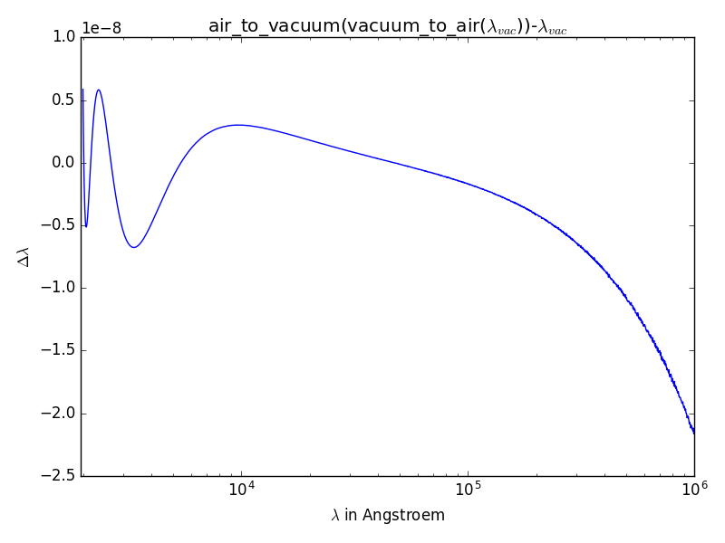

Package ``airvacuumvald``
=========================

Python implementation of the air-to-vacuum and vacuum-to-air wavelength conversion used by VALD
(Vienna Atomic Line Database).

Quoting `<http://www.astro.uu.se/valdwiki/Air-to-vacuum%20conversion>`_:

.. code:: none

    VALD3 stores vacuum wavelengths of all the transitions. This allows uniform handling of 
    extraction across the whole spectral range. On the other hand, the selection tools in VALD3 
    include options for returning the air wavelengths. Furthermore, some of the original line lists 
    include wavelengths measured in the air. This calls for conversion tools. 
    Such tools must be uniformly accurate and reversible across the whole spectral range.
    
    For the vacuum to air conversion the formula from Donald Morton (2000, ApJ. Suppl., 130, 403) 
    is used for the refraction index, which is also the IAU standard:
    
    n = 1 + 0.0000834254 + 0.02406147 / 
        (130 - s2) + 0.00015998 / 
        (38.9 - s2)
        
    , where s = 104 / λvac and λvac is in Ångströms.
    
    The conversion is then: λair = λvac / n.
    
    This formula comes from Birch and Downs (1994, Metrologia, 31, 315) and applies to dry air at 
    1 atm pressure and 15ºC with 0.045% CO2 by volume. The corrections to 
    Edlén (1953, J. Opt. Soc. Am., 43, 339) are less than 
    0.0001 Å at 2000 Å and less than 0.001 Å at 30000 Å.
    
    The opposite conversion (air-to-vacuum) is less trivial because n depends on λvac and 
    conversion equations with sufficient precision are not readily available. 
    VALD3 tools use the following solution derived by N. Piskunov:
    
    n = 1 + 0.00008336624212083 + 0.02408926869968 / 
        (130.1065924522 - s2) + 0.0001599740894897 / 
        (38.92568793293 - s2), where s = 104 / λair 
        
    and the conversion is: λvac = λair * n. 

Installation
------------

.. code:: shell

    pip install airvacuumvald

Example
-------

The following code reproduces the figure
shown in VALD3 Wiki (http://www.astro.uu.se/valdwiki/Air-to-vacuum%20conversion)
("comparison of the Morton and the inverse transformation by NP between 2000 Å and 100000 Å.")

.. code:: python

    import matplotlib.pyplot as plt
    import numpy as np
    import airvacuumvald as avv
    lambda_vac = 10**np.linspace(np.log10(2000), np.log10(1000000), 2000)
    y = ph.air_to_vacuum(ph.vacuum_to_air(lambda_vac))-lambda_vac
    plt.semilogx(lambda_vac, y)
    plt.xlabel("$\lambda$ in Angstroem")
    plt.ylabel("$\Delta\lambda$")
    plt.xlim([lambda_vac[0]-50, lambda_vac[-1]])
    plt.title("air_to_vacuum(vacuum_to_air($\lambda_{vac}$))-$\lambda_{vac}$")
    plt.tight_layout()
    plt.show()

Running this code generates the following figure:

|image0|

More examples
-------------

The following code converts wavenumber=2000 cm**-1 to wavelength in Angstrom::

    >>> import airvacuumvald as avv
    >>> print(avv.vacuum_to_air(1e8/2000))
    49986.36934549974

The following code converts wavelength=5500 Angstrom to wavenumber in cm**-1::

    >>> import airvacuumvald as avv
    >>> print(1e8/avv.air_to_vacuum(5500.))
    18176.768046090445

Source code
-----------

`<airvacuumvald/airvacuum.py>`_